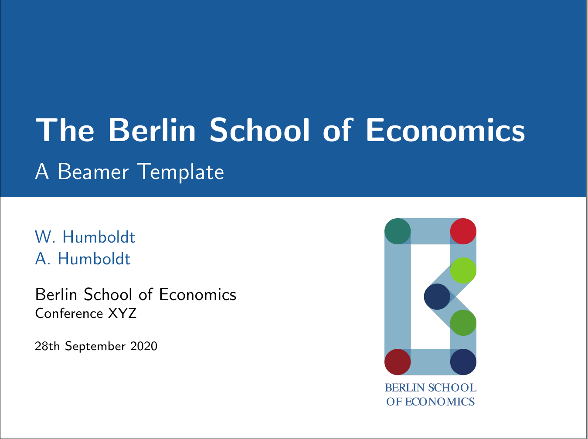

Berlin School of Economics (BSE) Templates
==========================================

In this repository you will find templates for presentation posters and slides using either Microsoft Powerpoint or LaTeX. If you make changes to any of these templates, feel free to share them with fellow members of the BSE through this repository.

For more information about the BSE, check out [our website](https://berlin-econ.de).

## Demo

The beamer presentation can be viewed at [overleaf.com](https://www.overleaf.com/read/jkvxrmxhvmbn).

This is a quick first impression of the LaTeX beamer template title page.

And here is the title page of the PowerPoint presentation template.

## Setup

### Powerpoint

Just open the `*.thmx` file and get started.

### LaTeX

For setting up the beamer template, you can either 

* copy/clone this repository and start making changes to the demo file, or
* copy the [`beamerthemebse.sty`](presentation/latex/beamerthemebse.sty) file and [*presentation/latex/images*](presentation/latex/images/) folder to an existing presentation and use the theme via `\usetheme{bse}`.

## License

The templates are released under open source licenses. The LaTeX beamer template is released under the GNU General Public License v3.0. The Powerpoint templates are released under the Creative Commons Attribution Share Alike 4.0 International license. See the `LICENSE` file for details.

Please note that copyright of the institution logos lies with the respective institution and their usage is restricted to those affiliated. 

