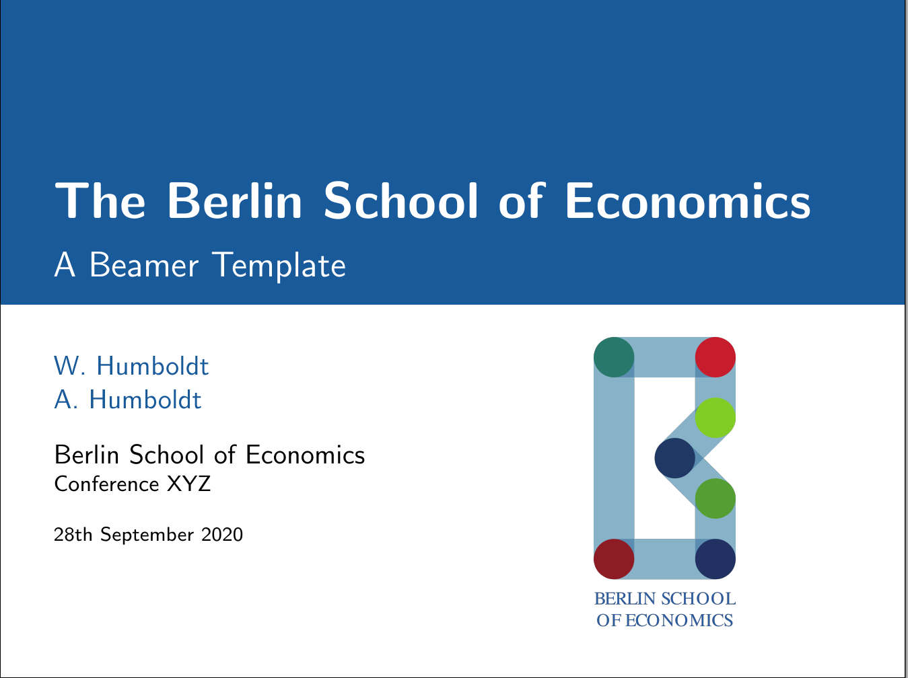

# BSE v1.0
A LaTeX beamer presentation theme for the Berlin School of Economics. It is based on the [focus](https://github.com/elauksap/focus-beamertheme) theme that aims at a clean, minimalist design with few distractions and thus puts the focus directly on the content.

The theme requires the packages [appendixnumberbeamer](https://ctan.org/pkg/appendixnumberbeamer),
and [PGF/TikZ](https://ctan.org/pkg/pgf) to be installed in your LaTeX distribution.
The [fira](https://ctan.org/pkg/fira) package provides a nice set of fonts, which are optional though.

Demo
----
A full demo is available. Refer to `demo.tex` and see the demo at [overleaf.com](https://www.overleaf.com/read/jkvxrmxhvmbn).



Instructions
============
After downloading, copy the file named `beamerthemebse.sty` into the same folder as your LaTeX source file together with the `images` folder.

Then include the theme by writing:
```latex
\documentclass{beamer}

\usetheme{bse}
```
in the preamble of your document.

Customize the footline
----------------------
The footline numbering can be customized through the theme option _numbering_. The standard value is:
```latex
\usetheme[numbering=progressbar]{bse}
```

that shows a progress bar of increasing length on the footline.

Alternatively, a full footline bar with author, title and frame numbering can be shown with:
```latex
\usetheme[numbering=fullbar]{bse}
```

The footline may also be disabled by typing:
```latex
\usetheme[numbering=none]{bse}
```

Customize fonts
---------------
BSE is using the [Fira fonts](https://bboxtype.com/typefaces/FiraSans/) by default.

This can be changed by using the option _nofirafonts_:
```latex
\usetheme[nofirafonts]{bse}
```

Thank You and License
---------------------

You can create a 'thank you' slide by including 
```latex
\makethanks
```

at the appropriate place. The thank you message can be edited via 
```latex
\thanksmessage{Have a great day.}
```

in the preamble of your document. The thank you page always includes a license notice for the [Creative Commons Attribution 4.0 International](https://creativecommons.org/licenses/by/4.0/) license. If you want to include the license notice somewhere else, you can do so with
```latex
\makelicense
```

License
=======
The theme itself is released under the [GNU GPL v3.0 License](https://www.gnu.org/licenses/gpl-3.0.en.html). 

Acknowledgement
===============

The BSE theme is based on the [focus](https://github.com/elauksap/focus-beamertheme) theme by [Pasquale Africa](https://github.com/elauksap). Other contributors include Sebastian Friedl, and Benjamin Goldman.
